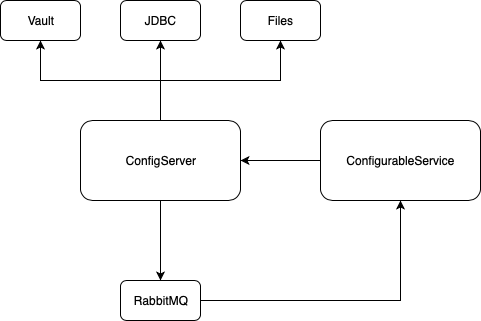

## Composite (JDBC/Vault/Local Files) Spring Cloud Config Server with Spring Cloud Bus client service
Spin up the Vault, H2 and RabbitMQ to work with applications within your IDE
```bash
 docker-compose -f docker-compose-infrastructure.yml up
```

Or you can run the full example with 

```bash
 docker-compose -f docker-compose-infrastructure.yml -f docker-compose-full.yml up
```

Change settings:
  - Play with Vault parameters: [http://localhost:8200/ui/vault/auth](http://localhost:8200/ui/vault/auth)
  - Change parameters via H2 console: [http://localhost:81/](http://localhost:81/)
  
Priorities are the next:
  - Vault
  - JDBC
  - Files
  

