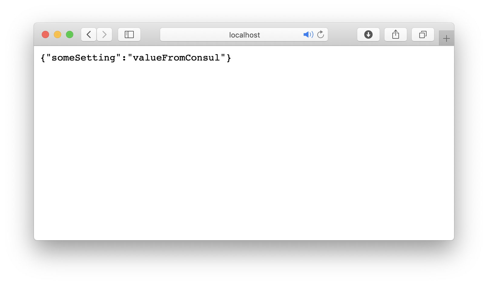

## Distributed configuration with Consul
Run full example with docker-compose
```bash
docker-compose -f docker-compose-consul.yml -f docker-compose-app.yml up
```

Open [http://localhost:8080/info](http://localhost:8080/info). You will see the default value of configurable setting


Open Consul UI [http://localhost:8500/ui/dc1/kv](http://localhost:8500/ui/dc1/kv) and create directory /config/ConsulConfigApp/
In that directory create key/value pair someSetting:valueFromConsul and open [http://localhost:8080/info](http://localhost:8080/info).
You will see the value you just saved in Consul.




Start only Consul if you want to play with it:
```bash
docker-compose -f docker-compose-consul.yml up
```