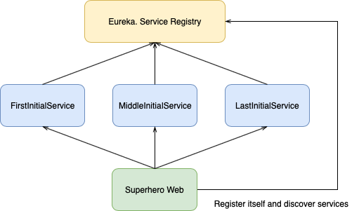
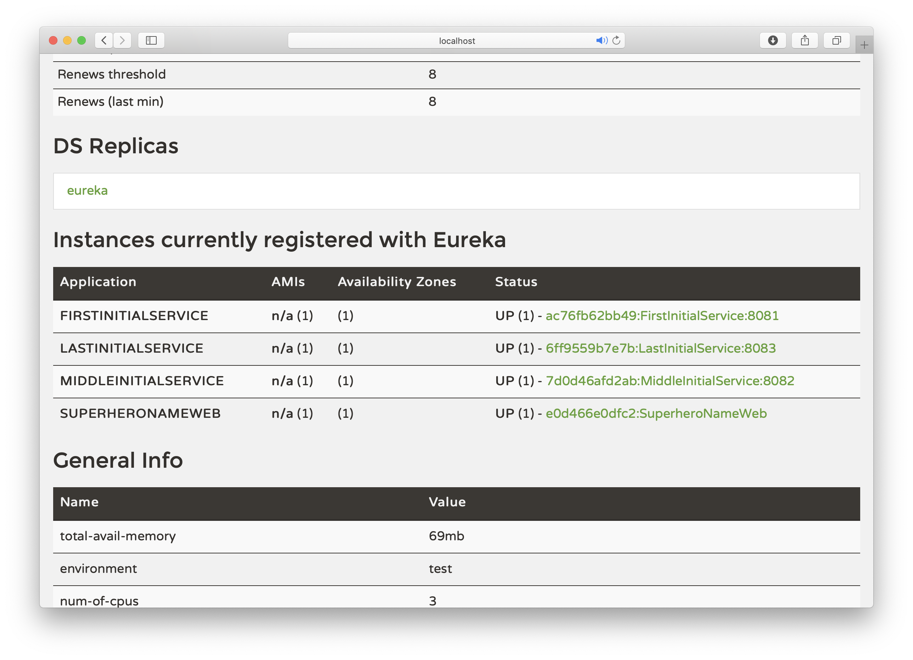
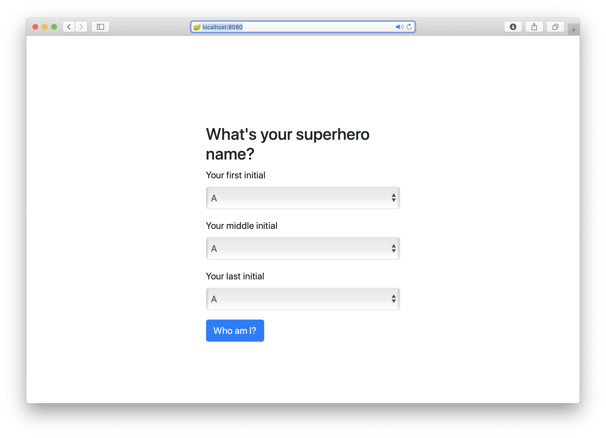
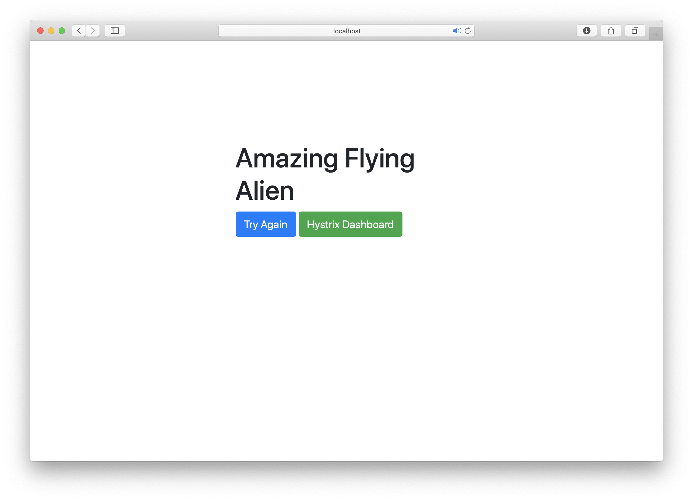
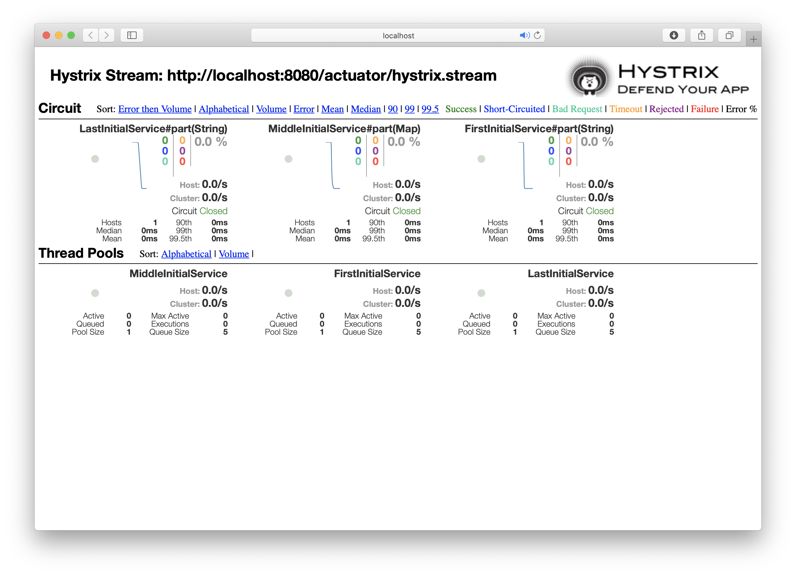
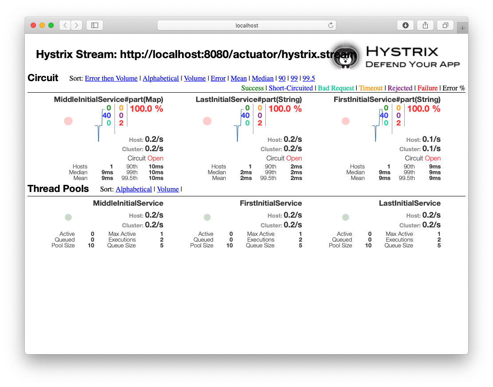

## What's your superhero name?
Enter your initials and find the answer :)

This is the example with 3 REST Services and single consumer.
Services and consumer uses Eureka for service discovery.
Consumer (superhero-name-web) uses Ribbon for client-side load balancing and Hystrix for circuit breaking.


Build the project:
```bash
mvn clean package docker:build
```

Go to superhero directory:
```bash
cd superhero-name
```

Run docker-compose to start all applications:
```bash
docker-compose up
```

Open [http://localhost:8000](http://localhost:8000) to see the Eureka dashboard to ensure that everything is up and running


Go to [http://localhost:8080](http://localhost:8080) and choose your initials


to get the answer

refresh the page to get some service crash (each of three REST services will crash when System.currentTimeMillis() % 10 == 0)

When all 3 REST services are down, you will always get the name "Stupid Jumping Skunk", since this value is generated by Hystrix fallbacks.

Click the button under the answer to see the Hystrix Dashboard


Turn off REST services
Run docker-compose to start all applications:
```bash
docker-compose stop first-inittial-service
```

```bash
docker-compose stop middle-inittial-service
```

```bash
docker-compose stop last-inittial-service
```

Refresh the page with answer and see, what's happening with Hystrix Dashboard.
